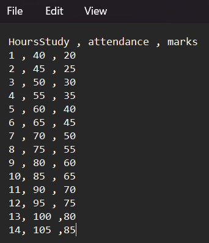
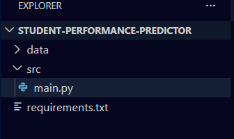
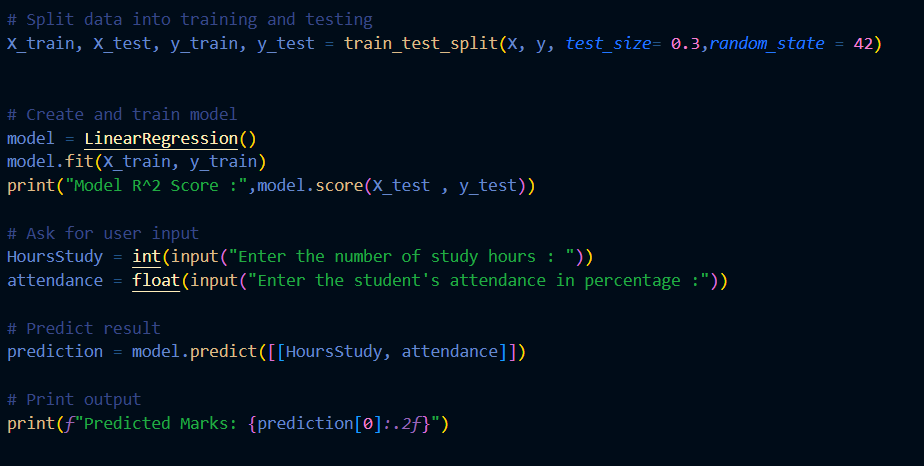
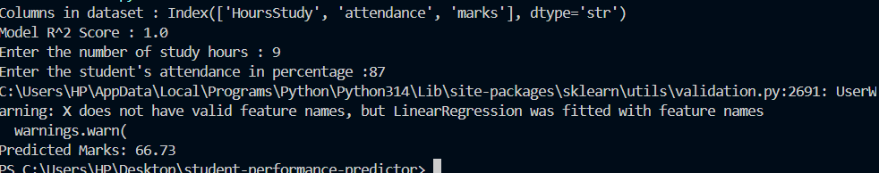

# Student-Performance-Predictor

The project predictes the students' progress based on **number of studying hours** and **attendance**
---

##Table Of Contents
1. [Project Overview](#project-overview)
2. [Datasets and Features](#datasets-and-features)
3. [Tasks Completed](#tasks-completed)
4. [How to run](#how-to-run)
5. [Screenshots](#screenshots)
---

##Project Overview
The given project uses AI and machine learning driven model to predict students academic progress 
The key features of the project are:
 **Studying Hours:**  Number of hours a student dedicate in studying
 **Attendance:** Number of classes attended(in perentage)
 The target is **predicted performance score** or grade
 
---
## Datasets and Overview
-- Analysing for different data values and predicting the results
StudyHours    |     Attendance(in %)      |      Marks
   11         |         87                |      67.12
    4         |         65                |      44.62
    8         |         98                |      77.12

## Tasks Completed

### **Task 1**
- Loaded the dataset and analysed it.
- Looked for missing values.

**Screenshot:**

---

### **Task 2 **
- Handled missing values .  
- Normalization of numerical data .

**Screenshot:**

---

### **Task 3**
- Training of a simple ML model(Linear Regression or Decision Tree) to predicate progess

**Screenshot:**

---

### **Task 4**
-Tested on unknown data and found the result
-Compared predicted vs actual values

**Screenshot:**

---

### **Task 5 – Result Visualization**
- Plotting of results and visualising the data pictorially
- Highlighting the trends between attendance , study hours , result
**Screenshot:**

---
## How to Run
1. Clone the repository:
git clone https://github.com/YOUR_USERNAME/STUDENT-PERFORMANCE-PREDICTOR.git

3. Navigate to the project folder:
  STUDENT-PERFORMANCE-PREDICTOR

5. Run the python file main.py to see the predictions(outputs)
